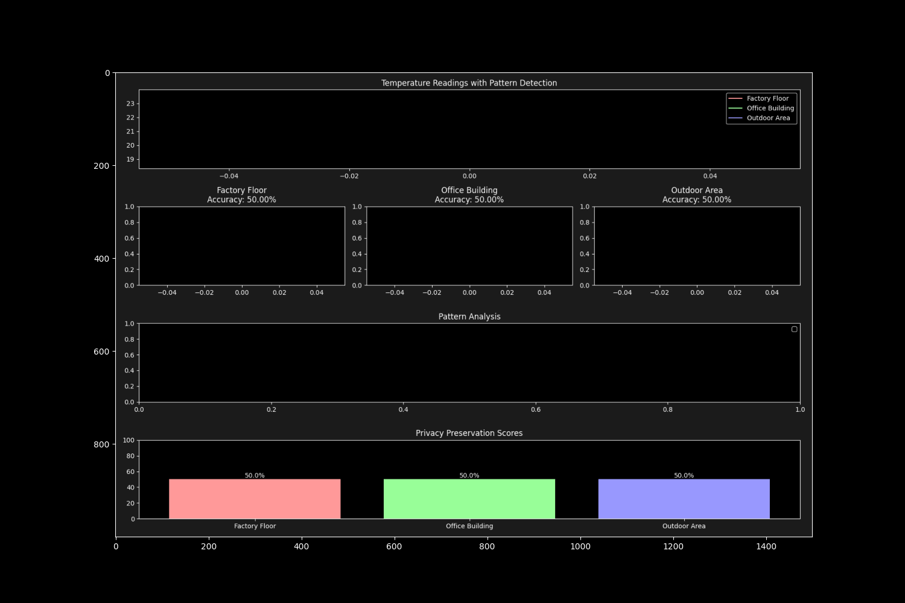

# 🌐 Federated Sensor Network (FedSense)

[](https://opensource.org/licenses/MIT)
[](https://www.python.org/downloads/)

A framework for privacy-preserving federated learning in sensor networks. This project demonstrates advanced concepts in pattern recognition, privacy preservation, and distributed learning systems.



## 🌟 Key Features

### Pattern Recognition
- **Dynamic Pattern Detection**: Real-time analysis of sensor readings
- **Event Impact Analysis**: Intelligent event-based pattern recognition
- **Adaptive Learning**: Continuous pattern refinement and accuracy improvement

### Privacy Preservation
- **Privacy Metrics**: Real-time privacy score tracking
- **Data Protection**: Minimal raw data sharing
- **Pattern Anonymization**: Secure pattern sharing mechanisms

### Advanced Analytics
- **Real-time Visualization**: Dynamic multi-plot analysis
- **Pattern Library**: Centralized pattern knowledge base
- **Performance Metrics**: Comprehensive accuracy tracking

## 🚀 Quick Start

### Installation

```bash
cd federated-sensor-network

# Create a virtual environment
python -m venv venv
source venv/bin/activate  # On Windows: venv\Scripts\activate

# Install the package
pip install -e .
```

### Basic Usage

```python
from fedsense.network import EnhancedFederatedNetwork

# Create and run a simulation
network = EnhancedFederatedNetwork()
network.run()
```

## 🎮 Advanced Usage

### Custom Sensor Configuration

```python
from fedsense.core import EnhancedSensor
import numpy as np

# Initialize custom sensor
sensor = EnhancedSensor(
    name="Custom Sensor",
    location=(0, 0),
    pattern_type="factory"
)

# Configure learning parameters
sensor.base_temp = 25.0
sensor.add_known_event("custom_event", 
    start_hour=10, 
    duration=2
)
```

### Pattern Analysis

```python
# Analyze patterns with custom window
patterns = sensor.learn_patterns(window_size=48)

# Access specific pattern metrics
daily_range = patterns['daily_range']
variance = patterns['variance']
trend = patterns['trend']
peak_hours = patterns['peak_hours']
```

## 🔧 Technical Details

### Core Components

1. **Sensor Systems**
   - Temperature pattern generation
   - Event impact modeling
   - Local pattern learning

2. **Privacy Framework**
   - Privacy score calculation
   - Data sharing controls
   - Pattern anonymization

3. **Federated Learning**
   - Distributed pattern recognition
   - Global knowledge aggregation
   - Model synchronization

### Performance Features

- Real-time pattern analysis
- Dynamic visualization updates
- Privacy-preserving data sharing
- Neural network-based learning

## 📊 Applications

- **Industrial IoT**: Factory sensor networks
- **Smart Buildings**: HVAC optimization
- **Environmental Monitoring**: Weather pattern analysis
- **Privacy Research**: Data protection studies
- **Distributed Systems**: Federated learning research

## 📄 License

This project is licensed under the MIT License - see the [LICENSE](LICENSE) file for details.

## 🙏 Acknowledgments

- Neural network components powered by PyTorch
- Visualization built on Matplotlib
- Console interface using Rich
- Special thanks to all contributors and the open-source community

---